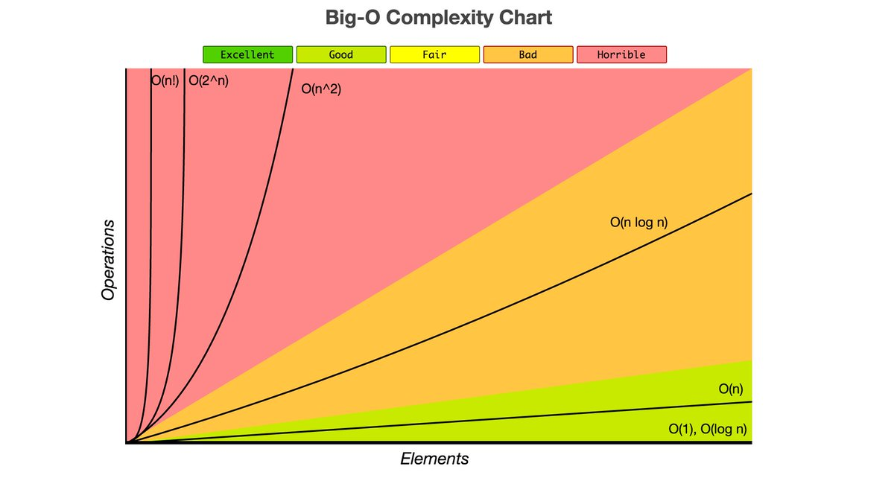

# Overview Of Big O Notation

## What is Good Code

Good code, in short, is readable, maintainable and scalable. Big O helps us with the scalable part of good coding practices.

## Why Big O Notation

The same algorithm or piece of code might take a variable amount of time to execute in different computers/firmware. A machine with a much higher configuration like an enterprise-grade server, than say a basic laptop can run the same program much faster or vice verse. So it is not practical to measure the performance of an algorithm in terms of time, as in a number like 10 milliseconds because the run time heavily depends on the hardware the program is running on and even the language and/or runtime on which the program was written/intended to run.

Since computers are generally fast in this day and age, we as programmers/architects need an alternate way of efficiently communicating the time an algorithm is expected to run regardless of the external factors like hardware/software, etc. Enter Big O Notation...

## What is Big O Notation

Big O is used to define the time and space complexity of an algorithm that solves a single problem. Simply put it is the language software developers use to define how long an algorithm takes to run, as in we express the runtime in terms of how quickly the runtime grows relative to the input. It is also used to compare two algorithms aimed at solving the same problem, to identify which algorithm scales better, i.e., how the run time of each algorithm changes or if it changes at all as the input size increases.

It's hard to arrive at the exact runtime of an algorithm since it depends on the external factors as mentioned previously so instead of talking about the runtime directly, we use big O notation to talk about how quickly the runtime of an algorithm is expected to grow relative to the input. This does not mean you fully base your choice of the algorithm just on Big O time complexity, you should also consider the space/memory an algorithm might take, runtime since if the memory footprint/performance of the target platform is low an algorithm which is memory efficient might be a better choice.

We can majorly categorize time complexity to:

- Constant Time O(1): It takes the same number of steps to execute the algorithm regardless of the size of the input n.
- Liner Time O(1): It takes n steps to execute the algorithm i.e., as the input size grows the time to execute the algorithm increases linearly.
- Quadratic Time O(n^2): It takes n^2 steps to execute the algorithm i.e, as the input size grows the time to execute the algorithm increases quadratically.

All of them mostly listed below:

- Constant Time O(1)
- Logarithmic Time O(log(n))
- Linear Time O(n)
- Linear Logarithmic Time O(nlog(n))
- Quadratic Time O(n^2)
- Cubic Time O(n^3)
- Exponential Time O(b^n), b > 1
- Factorial Time O(n!)

Take a look at the chart below which show the various time complexities, note that we simplify the big o for an algorithm to one of the below using two simple steps listed in the [next]({{site.baseurl}}) section. We will look at each of these in detail in the upcoming sections. The below chart to determine how your algorithm is expected to perform as your input size grows, ideally, we should target O(n) which is the most common among all of these for most use cases or algorithms.

[Next >> Steps to Derive Time Complexity - Take 1](./StepstoDeriveTimeComplexity.md)

[Index](./README.md)
